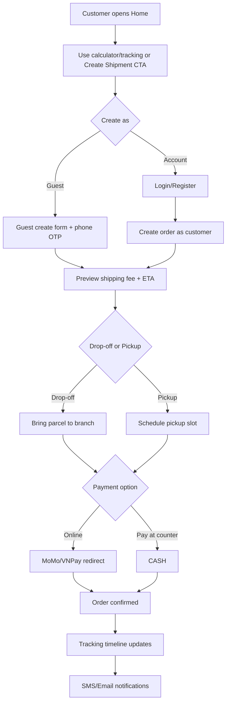
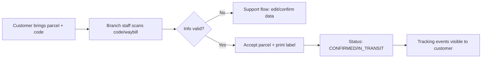

# B2C Expansion Flow (Based on Current AP-POST Project)

Tài liệu này bám trực tiếp vào cấu trúc hiện tại:
- FE: Angular routes (`tracking`, `calculator`, `employee/...`)
- BE: NestJS modules (`orders`, `payments`, `tracking`, `momo`, `vnpay`, `mail`)
- Luồng hiện tại vẫn thiên về nội bộ (STAFF/ADMIN tạo đơn), cần thêm lớp self-service cho khách lẻ.

## 1) Current-state flow (B2B/internal-assisted)

```mermaid
flowchart LR
    A[Staff/Admin Login] --> B[Employee/Admin Create Order Form]
    B --> C[POST /orders (JWT required)]
    C --> D[OrdersService.create]
    D --> E[PricingService.calculateShipping]
    D --> F[Create Address + Order + Tracking]
    D --> G[PaymentsService.createPaymentForOrder]
    G --> H{paymentMethod}
    H -->|CASH/COD| I[Complete create flow]
    H -->|MOMO| J[Initiate MoMo redirectUrl]
    I --> K[Waybill generated]
    J --> K
    K --> L[Customer tracks via public tracking page]
```

## 2) Target-state flow (B2C self-service + keep B2B intact)

### Core principle
- Giữ nguyên luồng B2B hiện tại.
- Thêm luồng B2C theo kiểu "guest-first", sau đó mới upsell đăng ký tài khoản.



## 3) Suggested implementation map in your existing codebase

## FE changes
- Add public route: `/ship` (or `/create-shipment`) for B2C self-service form.
- Reuse most logic from `dashboard-emoloyee/dashboard-orders/createOrder`:
  - địa chỉ gửi/nhận
  - tính phí realtime
  - chọn `paymentMethod`
- Keep existing `tracking` + `calculator` public pages as top-of-funnel.
- After successful guest order:
  - show `waybill` + QR/code
  - offer "Create account to save order history".

## BE changes
- Keep current protected `POST /orders` for STAFF/ADMIN.
- Add new public endpoint for B2C, e.g.:
  - `POST /orders/public` (guest + OTP token)
  - optional `POST /orders/public/verify-otp`
- In service layer, add order source:
  - `channel = B2B_STAFF | B2C_GUEST | B2C_USER`
- For B2C guest records:
  - attach `guestContact` (phone/email)
  - `userId` can be nullable until upgraded/linked.
- Reuse `PricingService`, `PaymentsService`, `MailService`, `Tracking`.

## Auth strategy for B2C
- Guest allowed to create order with OTP verification.
- Account users can create without OTP each order (after login).
- Existing role flow (`ADMIN/STAFF`) remains unchanged.

## 4) Operational flow at branch for B2C



## 5) Rollout plan (low risk)

### Phase 1 (fastest)
- Public B2C form as guest.
- Drop-off only.
- Basic payments (`CASH`, optionally `MOMO`).
- Tracking + email confirmation.

### Phase 2
- Pickup scheduling.
- Better anti-spam/fraud checks.
- Guest-to-account upgrade flow.

### Phase 3
- Loyalty/referral.
- Saved addresses + quick reorder.
- Full omnichannel notification policy (SMS/push/email).

## 7) Phase 3 hardening đã triển khai
- OTP B2C được lưu DB (`public_order_otps`) thay vì memory.
- Chống spam OTP:
  - cooldown giữa 2 lần gửi (mặc định 60 giây),
  - giới hạn tổng số OTP trong 30 phút (mặc định 5 lần),
  - giới hạn sai OTP tối đa 5 lần.
- OTP one-time-use:
  - chỉ cho tạo 1 đơn sau khi verify,
  - tự đánh dấu `usedAt` khi tạo đơn thành công.
- Gán bưu cục nâng cao:
  - ưu tiên match theo `communeName`,
  - fallback về `provinceName` nếu không có chi nhánh cùng phường/xã.
- Tự liên kết đơn guest sang tài khoản:
  - khi user đăng ký, hệ thống quét đơn `B2C_GUEST` chưa gán `userId`,
  - match theo email/số điện thoại người gửi,
  - chuyển `channel` thành `B2C_USER` và gắn `userId`.

## 6) KPIs to validate B2C
- Form completion rate.
- Payment success rate (online).
- Drop-off completion rate after order creation.
- First-attempt delivery success.
- Support tickets per 100 orders.

